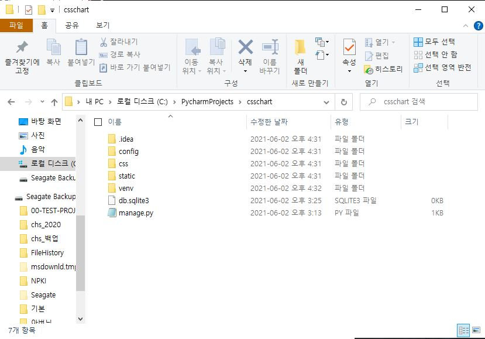
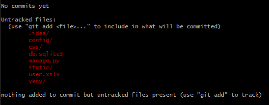
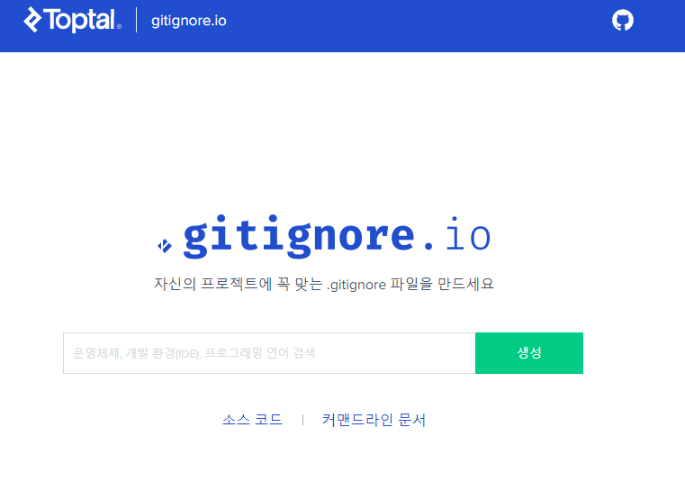

# 프로젝트 기본

예시는 아래의 django 프로젝트를 기준으로 함



# Git 저장소 설정

```bash
$ git init
```


## gitignore

> git으로 관리하지 않을 파일/폴더 등을 관리해줌

* `.gitignore` 파일을 만들어서 관리

  ```bash
  user.csv # 특정 파일
  venv/ # 특정 폴더
  *.csv # 특정 확장자
  ```

  * 개발 프로젝트시 어떤 것들을 gitignore로 관리를 하는가?
    * OS(운영체제)에서 확용되는 파일들
    * IDE(통합개발환경-ptcharm), Text editor(vs code) 등에서 활용되는 파일
      * 예) pycharm -> .idea/
    * 개발 언어(python) 혹은 프레임워크(django)에서 사용되는 파일
      * 가상환경 -venv/
      * `__patch__/` ...




### gitignore.io

* [링크](https://www.toptal.com/developers/gitignore)
* 본인 개발 환경에 대한 내용을 넣고 생성하면, 일반적으로 개발자들이 많이 쓰는 gitignore 문서를 제공한다.



* 혹은, github에서 제공하는 문서들을 받아서 활용해도 좋다.
* [링크]/[파이썬 링크](https://github.com/github/gitignore)

