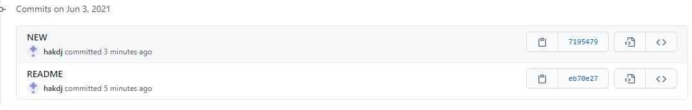

 

링크확인용

http://bit.ly/big210603

 


그래픽 유저 인터페이스

그래픽으로 사용자가 접근/활용

커맨드라인 인터페이스

명령줄로 접근/활용

 

API-application programming interface

 

Touch AA.txt  -> 비어있는 AA파일을 만든다.

 

 

커밋은 (commit)은 버전을 기록하는 것이다.

Add는 커밋할 파일 모으기

머릿속에 항상 크게 3개의 박스를 생각하기 (큰박스안에 작은 3개의 박스)

이메일은 깃헙에 가입한 이메일 사용

 

$ git config --global -l

 

gui.recentrepo=E:/chs_2020/study/git

user.name=hakdj

user.email=hakdjhakdj@naver.com

 

 

처음 터치를 하면 세개의 작은박스중에 젤 왼쪽으로 들어간다. 

add명령어를 하면 난 이 파일을 add할꺼야. 그럼 새로운 스태이터스가 된다.

그리고 마지막으로 커밋을 해서 세번쨰(젤 오른쪽)박스로 들어가게 되고, 기록을 시킴 (하나의 버전으로) 즉 하나의 버전이 탄생됨.

 

Git log를 통해서 버전정보를 본다. 각버전에 대한 정보가 나옴.


1. 폴더를 Git저장소로 초기화(생성)
2. Git init

touch a.txt > 파일 만들기

git init

git add .

git commit -m 'First commit'

git status

git log


# typora 배우기

# 마크다운 문법

typora는 마크다운 문법을 사용함

## 제목(heading)

### 헤헤 

문서의 구조를 잡기 위해 활용된다.


#### ㅎㅎㅎ

###### ㅎㅎ

샾 갯수에 따른 글자 크기 및 구조

`#`  샾을 쓰고 싶으면 일케쓰면댐

*^* 허허 

별별 하면 위에처럼됨.

* 하이루

* 하하

  * 하하

  하하

별 쓰면 하이루 처럼됨.

1. ㅎㅎ
2. ㅎ
3. ㅎㅎㅎ

쉬프트 탭으로 밖으로나옴

```
def
```

# 코드블록

인라인 코드블록 `def`


```python
#주석
print('hello')
def foo():
    return True
```

파이썬 코드는 ```입력하면됨.

아래처럼 html기능도 됨

```html
<!--주석-->
<h1>
    hello
</h1>
```

마크다운에 여러 기능들,.

 # 표

| 순번 | 이름 | 학번 |
| :--- | ---- | ---- |
| 1    |      |      |
| 2    |      |      |
| 3    |      |      |

컨트롤 슬래쉬하면 소스코드모드로 됨.


## 이미지


